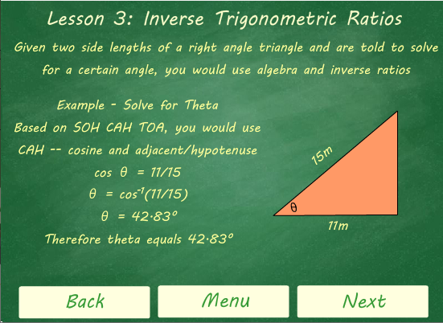

# Trigonometric-Practice
This application teaches the basics of trigonometry through five lessons with an option to take an interactive quiz with randomized questions. Created using ActionScript 3.0 and Adobe Flash.

It can be found on the Google Play Store as [Trigonometric Practice](https://play.google.com/store/apps/details?id=air.arifazmi.trigonometricpractice&hl=en).

### Setup

#### On Desktop
Download Trigonometric Practice.fla to get source code file.

To open this file you will need to download [Adobe Animate CC](https://www.adobe.com/ca/products/animate.html)

**Note: You can get a 7 day trial to test the game out but will need to purchase a membership after that.**

When you have the file opened on Adobe Animate CC press `Ctrl+Shift+Enter`

This should open the swf file allowing you to try the app!

#### On Mobile
**Note: Only available on Android phones**

Download *Trigonometric Practice* from the Google Play Store.

### Game Interface
The app has a total of five frames with the *Lessons* frame containing five lessons.

#### 1. Main Menu

#### 2. Lessons

###### Lesson 1

###### Lesson 2

###### Lesson 3

###### Lesson 4

###### Lesson 5

#### 3. Quiz Instructions

#### 4. Quiz
Sample Questions:

#### 5. Quiz Results 

